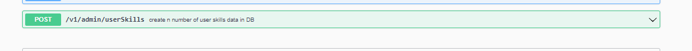
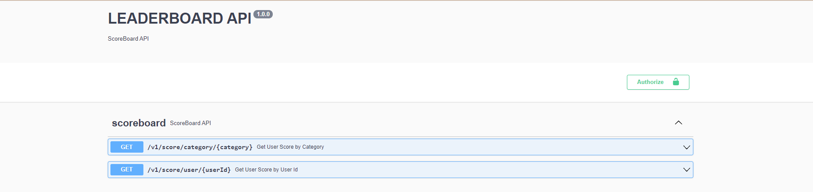
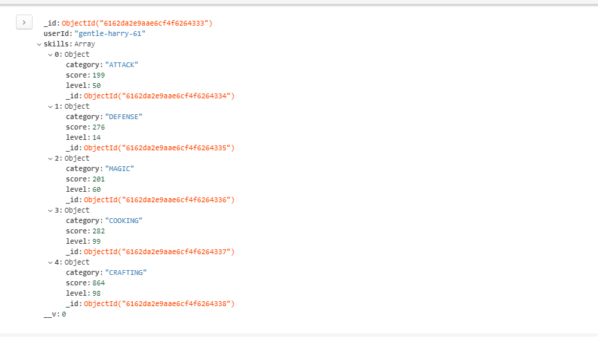
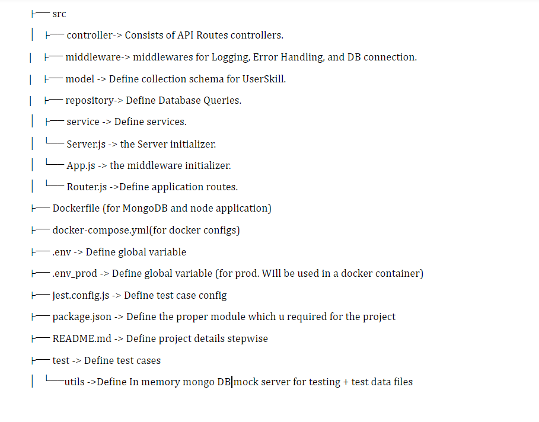

# scoreboard-API

A Node JS (Express) based Rest API which will provide a high scoreboard for a game
### Prerequisites

- NodeJS (V16)
- mongoDB

or else

- docker (If you are going to up the project in docker)

### Exposed Ports

| S/N | Application | Exposed Port |
|-----|-------------|--------------|
| 1 | database | 27017 |
| 2 | applicaiton | 8000 |

### To Start the service In Local

#### start the backend

- `npm install`
- `npm run start:local`

All the commands should be run from the root directory
 

### To Start the service In Docker

`docker-compose up --build`

#### To set up data in mongo DB collection

- you can either import the collection I have provided in
  resources folder `(resources\skills.json)` or,
-  can use the below utility endpoint which I have provided.

#### To run the unit tests

`npm run test
`
#### To start the frontend

Kindly follow https://github.com/AchiniP/game-scoreboard-ui#readme

### To Sanity check whether your app is running

You Should be able to call (GET) following endpoint and it will return 200 OK message

`http://localhost:8000/v1/healthcheck`

(If you loaded the project in docker, use the corresponding docker host URL. Ex:- `http://192.168.99.100:8000/api-docs/` )

### API docs

- Once the app is started, API document (Swagger) can be found in

`http://localhost:8000/api-docs/#/`

All the request and Response Models and can be found in api-docs

### Available Endpoints

### Other Utility Endpoints

In case you need to generate DB model documents in Mongo DB, I have added one admin function to create n number
of documents in Mongo DB

### Design Assumptions

- This application is designed to retrieve scores of a game.

#### Database Design

Format of a sample userSkill Model as follows.
where each User skill document consists of 2 main attributes.
 
 
`{
userId: String,
skills: [ array of objects {category, level, score ]
}`
 
 

### Code Structure

### Libraries Added

- compression - NodeJS compression middleware
- CORS - nodeJS cors middleware
- dotenv - to load environment variables from .env file
- joi - For API request parameter validations
- mongoose - Mongo DB ODM
- winston - Logger library

#### Dev dependencies

- babel (transpiler)
- swagger-jsdoc - For API documentation
- eslint (for linting)
- jest (for TDD - unit testing)
- sinon (for unit tests - For method stubbing)
- mongodb-memory-server (mongodb in memory server for testing)

